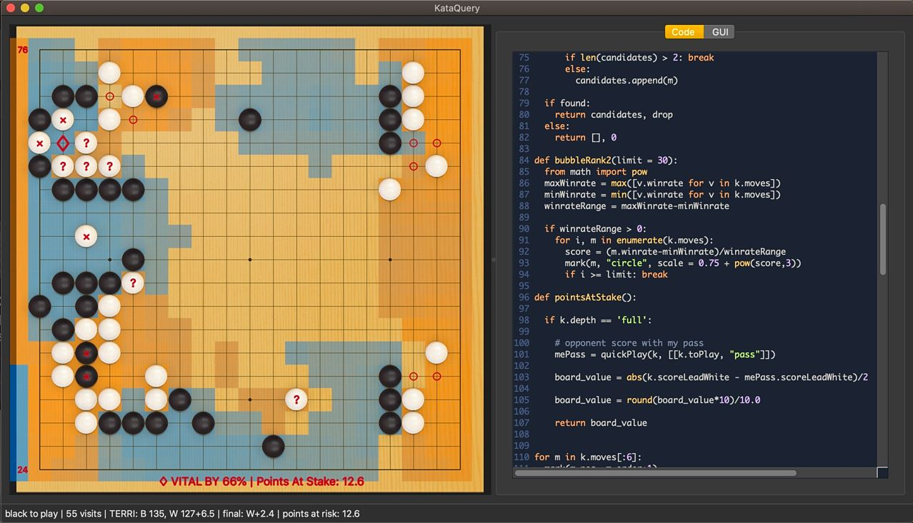

# KataQuery

KataQuery is a freeform, scriptable analysis goban for interactively exploring Go (aka Baduk/Weiqi).



Each time the position changes, your Python script is run, which marks up the board in any way it likes. Scripts have
full access to KataGo's analysis, and display their results in real time.

## What Might Surprise You

KataQuery's goban is "freeform," so you can move, delete, and copy stones. This allows you probe KataGo's thoughts about
any position you dream up.

As a result, "Move order" is a fuzzy concept in KataQuery. KataQuery can only track sequences fully if you leave stones
mostly where they are (but I hope you don't!).

While you can certainly review a game in KataQuery, there is limited SGF import, and clunky export (you must do it through a script). SGF export *will* be supported, but KataQuery is definitely *not* an SGF editor. It's built for exploration and "Asking Questions."

## Requirements

* python >= 3.9
* make
* cmake >= 3.18.2
* libzip
* c++ compiler for KataGo
* Pretty good GPU for interactivity

For arch linux, you can install library dependencies like so:
```
sudo pacman -S yay
yay -S patch make cmake opencl opencl-clhpp eigen libzip
```

Of course, don't install opencl/eigen if you don't need it or want it.


### Libraries:

* opencl -- if you want CUDA or EIGEN you'll need to modify `makefile`
* qt and other python requirements will be created inside the virtual environment

## Installing

KataQuery is meant for normal users. For the moment, however, you have to build it yourself with the makefile:

```
cd KataQuery
make
```

This will build the KataGo engine and create a virtual environment necessary for running KataQuery.

If the default build doesn't work for you (pyinstaller tries to build a clickable app) you can try:

```
make command-line
```

To run KataQuery, type:

```
. run_kataquery.sh
```
or double-click the app in the `dist/` folder

## How To Use

### HOW TO PANIC
> If your script gets in an infinite loop or crashes KataQuery, you can temporarily disable script execution by holding `SHIFT` during startup.

### Playing Stones

By default, you're in "Play Mode," which alternates colors for you, and sets the analysis perspective to the current
person to play.

* To **place** a stone, click.
* To **move** a stone, click and drag.
* To **copy** a stone, alt-click and drag.
* To **erase**, right click.

Analysis perspective when dragging is like this:

1. If it's a new stone, show the opponent responses.
2. If it's a copied stone, keep the current perspective
3. If it's a moved stone, keep the current perspective

As you drag, KataQuery will use "quick analysis," which by default is 2 visits. This is to keep things snappy as you try
different placements. When you release the mouse, a "full analysis" is performed, which uses more visits.

### Painting

* To **paint a black stone**, click and/or drag.
* To **paint a white stone**, shift-click.
* To **erase**, right-click

In "Draw Mode," the analysis perspective never changes. This has some interesting uses.

These shortcuts are subject to change as I continue tweak it to have the most "flow."

### Bookmarks
Bookmarks are created "On Request." That means: your edits aren't automatically remembered in the history, *you must
save a position to return to it.* This is to keep things from getting hella confusing when dragging about stones, etc.

To create a positional bookmark, use the "Bookmarks" menu or CMD-SHIFT-B

To navigate through your bookmarked positions, use the mouse wheel.

When you change board sizes, all bookmarks are deleted.

In the future there will be a more visual way to navigate bookmarked positions.

### SGF Import
SGF Import (Board->Import SGF) loads the main line of an SGF file and creates a bookmark for every new position (aka "move"). This allows you to navigate through a game using the scrollwheel.

I have no dreams of supporting full SGF trees and whatnot, as KataQuery is built for interaction rather
than replay. But at least the import feature makes it possible to review a game without manually inputting moves.

SGF export is possible through a script (see `script_examples/api_demos/goban_object.py`). For the moment, I have to decide how to treat positions in the SGF (collections, diagrams, or etc) before I implement export.

### Neural Networks

KataQuery supports only two neural networks: a snappy network, and an unfathomably strong one. That means:

1. strongest 15-block network (kata1-b15c192-s1672170752-d466197061.txt)
2. strongest confidently rated nbt network (kata1-b18c384nbt-s9131461376-d4087399203.bin)

These networks are included.

The 15-block network is both superhuman and fast, so it should meet your needs. It also gives more move suggestions,
which is useful in an analysis environment. This is the default network in KataQuery.

To change networks, select "Neural Nets" from the "Board" menu.

> I may add a third network < 15 blocks for users with slow gpus.

#### Analysis "Purity"
When you choose "pure" in the Neural Net dialog box, KataGo is launched with a special config "analysis-zero.cfg", which eliminates all human-curated biases and randomness. In short, "pure" KataGo will play the exact same moves even if you generate 100 of them.

It's nice for inspecting the network itself, or when you find move suggestions too noisy. However, it's of limited value when exploring go, since moves are repetitious.

### Scripting

> WARNING: The API wil change drastically as I attempt to K.I.S.S. during alpha.

Check out the `script_examples` folder for now until I write full documentation.

In general, when the position changes, your script is run, and provided a global variable `k`, which is your access to
all of KataGo's analysis of the current position. You inspect `k`, calculate brilliant things, then mark up the board,
etc.

```
# show the suggested moves, ranked
for m in k.moves:
    mark(m, m.order+1)
```

Scripts are typical python, so you have all the python facilities at hand.

Included importables are `pandas`, `numpy`, `matplotlib` and a few other I forget at the moment. Of course, you can import all the
standard python things you want.

#### Script Slots
Scripts are automatically saved in "slots," which you can activate via shortcut or the "code" menu. This allows you to
have diverse scripts at hand for different perspectives on the position.

To toggle between two slots, tap the same shortcut twice or more (e.g. CMD-1, CMD-1 )

If you need advanced editing capabilities, right now you'll have to copy and paste from an external editor.

### Analyze More

The "Analyze More" feature (Board->Analyze More) is different from other frontends. Instead of analyzing forever and
updating as results come in, you "feed" KataGo more visits when you want a deeper analysis. This keeps the interface
snappy and furthermore allows you to investigate the effect of visits on analysis.

To adjust the amount of visits to feed KataGo per "Analyze More," choose `Board->Neural Nets...` from the menu.

When you flip players, the same amount of accumulated visits will be used for the opponent. This is to keep
compare/contrast strategies consistent.

## Future Plans

There's a lot I want to do with KataQuery, from graphics improvements to differential position analysis features, and
various GUI doodads that can make analysis easier. Too much to list here. However, for the near future, I'll be
normalizing the API, adding SGF export, and tweaking the UX to make exploration as fluent as possible.
