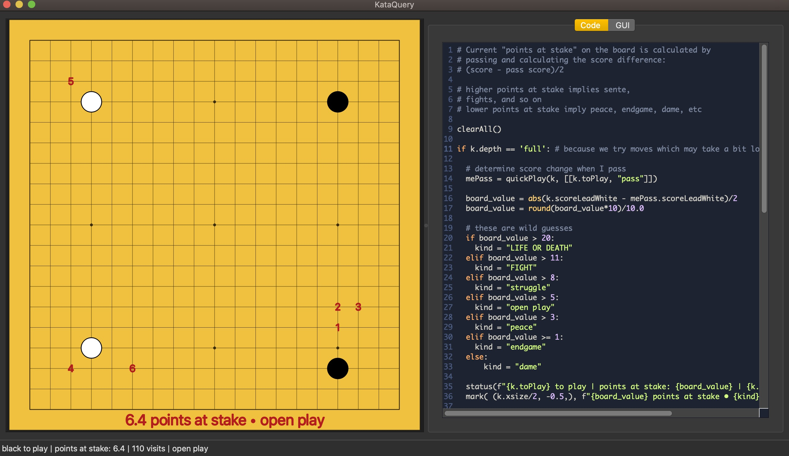

# KataQuery
KataQuery is a freeform, scriptable analysis goban for interactively exploring Go (aka Baduk/Weiqi).

 

Each time the position changes, your Python script is run, which marks up the board in any way it likes. Scripts have 
access to KataGo's full analysis, and display their results in real time.

# What Might Surprise You
KataQuery's goban is "freeform," meaning you can create/delete/drag stones at will. This lets you probe Katago's thoughts
about any position you wish, much like asking a teacher with a real goban. "Move order" is a fuzzy concept in 
KataQuery. KataQuery can only track sequences if you leave stones where they are (but I hope you don't!).

While you can certainly review a game in KataQuery, there is no SGF import at the moment. SGF import/export
*will* be supported, but KataQuery is definitely *not* an SGF editor. It's built for exploration & "Asking Questions."

# Requirements

* python3.9
* cmake >= 3.18.2
* c++ compiler for KataGo
* Pretty good GPU for interactivity

**Libraries:**
* opencl -- if you want CUDA or EIGEN you'll need to modify `makefile`
* qt and other python requirements will be installed by make

# INSTALLING
KataQuery is meant for normal users. For the moment, however, you have to mess with the makefile:

```
cd KataQuery
make
```

This will build the katago engine and set up a virtual environment necessary for running KataQuery.

To run KataQuery, type:

```
. run_kataquery.sh
```

# How To Use
* To **place** a stone, click. 
* To **move** a stone, click and drag. 
* To **copy** a stone, alt-click and drag.
* To **erase**, right click.

By default you're in "Play Mode" which alternates colors for you, and sets the analysis to the current person to play.

## Painting
Painting mode is simple:
* To **paint a black stone**, click and/or drag.
* To **paint a white stone**, shift-click.
* To **erase**, right-click

In "Draw Mode," the analysis perspective never changes. This has some interesting uses.

These shortcuts are subject to change as I continue tweak it to have the most "flow."

# Scripting
WARNING: The API wil change drastically as I attempt to K.I.S.S. during alpha.

Check out the `code_editor_examples` folder for now until I write full documentation.

In general, when the position changes, your script is run, and provided a global variable `k` which
is your access to all of katago's analysis of the current position. You inspect `k`, calculate
brilliant things, then mark up the board, etc.

```
# show the suggested moves, ranked
for m in k.moves:
	mark(m, m.order+1)
```

Scripts are typical python, but note that there are some global/local scoping quirks with running
it ATM.

Included libraries are `pandas`, `numpy`, and a few other I forget at the moment. Of course you can
import all the standard python things you want.

Scripts are saved automatically in "slots" which can be activated with shortcut keys or
via the "code" menu. This allows you to have diverse scripts at hand for different 
perspectives on the position.

If you need advanced editing capabilities, right now you'll have to copy and paste from an external editor.

# Analyze More
The "Analyze More" feature (Board->Analyze More) is different from other frontends. Instead of analyzing forever and updating as results come in,
you "feed" KataGo more visits. This allows the interface to remain snappy and allows for investigating the effect of visits on analysis.

ATM starting visits are set to 100. In the future you will be able to tweak these values per network from the GUI.

NOTE: when you flip players, the same amount of accumulated visits will be used for the opponent. This is to keep compare/contrast 

# Future Plans
There's a lot I want to do with KataQuery, from graphics improvements to differential position analysis features, and various
GUI doodads that can make analysis easier. Too much to list here. However for the near future, I'll be normalizing the API, adding SGF import/export, 
and tweaking the UX to make exploration as fluent as possible.
